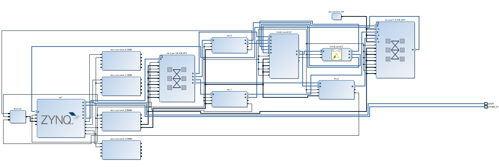
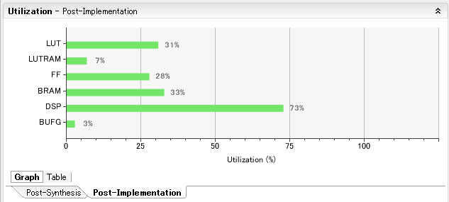

# pynqmmult
"mmult" example using SDSoC for [PYNQ](https://github.com/Xilinx/PYNQ) board

## Future work

* implementation of neural network on PYNQ
* combinaton of [Chainer](https://github.com/pfnet/chainer) and PYNQ

## Thanks to

* https://github.com/hackwa/pynqfire
* [Adam Taylor’s MicroZed Chronicles, Part 160: Creating an SDSoC Platform for PYNQ](https://forums.xilinx.com/t5/Xcell-Daily-Blog/Adam-Taylor-s-MicroZed-Chronicles-Part-160-Creating-an-SDSoC/ba-p/738145)
